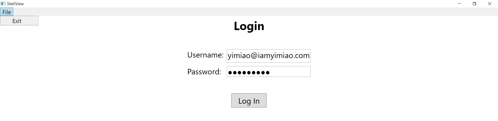
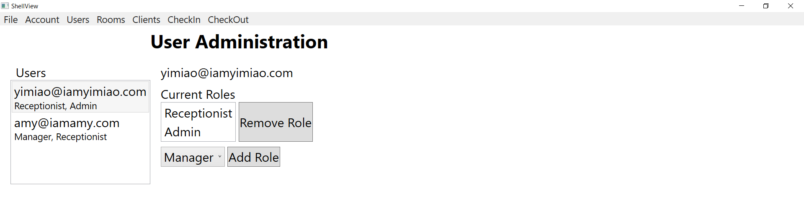

# Hotel Management System

A desktop app that runs a hotel management system to handle User authorization and permission, manage Rooms, Clients, CheckIn and CheckOut. A middle WebAPI layer that can service a desktop application was created to allow the app to grow. Technologies that involved in this app development include: Dependency Injection(Bootstrapper), ASP.NET MVC, Git, SQL database(SSDT), WebAPI with authentication, Async, WPF(with MVVM using Caliburn Micro) that logs into the API, JavaScript, HTML, CSS.

--------Swagger was used to document and demonstrate the WebAPI--------

--------Successful login allows the display of app menus on top of the shell window--------

--------Only User with Admin role is allowed to manage the User information--------

--------Unauthorized User is banned from manipulating the User information--------

--------Room View displays all room information and allows Add, Edit and Remove room information from the SQL database--------

--------Client View displays all client information and allows Add, Edit and Remove client information from the SQL database. Select a client in the data grid and hit the "Switch To Check In" button allows switching to the CheckIn View and automatically filling in available CheckIn information for the selected client--------

--------Room View displays all room information and allows Add, Edit and Remove room information from the SQL database--------

--------CheckIn View allows displaying information for already checked-in client if typing in the client name. For new checkIn, client needs to register in Client view first and then fill in required information to check in. CheckIn View also allows clearing the filled-in fields and removing CheckIn information from the SQL database--------

--------Select one room type from the Type drop-down allows display of the available room numbers in the Number drop-down--------

--------CheckOut View allows display of the checkOut information when typing in the room number that needs to check out--------

--------A warning message will show up if typing in wrong room number for CheckOut--------

