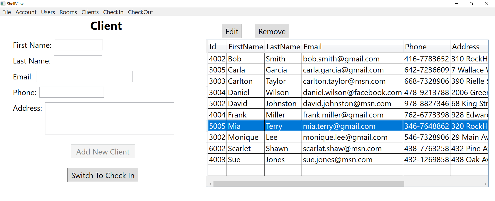

# Hotel Management System (.NET Framework)

<ul>
  <li> A desktop application that allows users to manage Hotel Rooms, Clients, Checkins, Checkouts and Sales Reports with User Authentication and Permission. </li>
  <li> A middle Web API layer that services the desktop application was created to expand the utility of the app. </li>
  <li> Front-end was implemented with Windows Presentation Foundation (<strong>WPF</strong>) using Caliburn Micro's MVVM pattern and Dependency Injection container. </li>
  <li> The middle API layer was implemented using ASP.NET MVC and Web API, Swagger with Authentication and Authorization, and Async/Await. </li>
  <li> Back-end was implemented with Microsoft SQL Server Data Tools (<strong>SSDT</strong>). </li> 
</ul>

<h3></h3>
<h3> Swagger was used to document and demonstrate the Web API</h3>

<h3></h3>
<h3>Successful login allows the display of app menus on top of the shell window</h3>

<h3></h3>
<h3>Only User with Admin role is allowed to manage the User information</h3>

<h3></h3>
<h3>Unauthorized User is banned from manipulating the User information</h3>

<h3></h3>
<h3>Room View displays all room information and allows Add, Edit and Remove room information from the SQL database</h3>

<h3></h3>
<h3>Client View displays all client information and allows Add, Edit and Remove client information from the SQL database. Select a client in the data grid and click the "Switch To Check In" button allows switching to the CheckIn View and automatically filling in available CheckIn information for the selected client</h3>

<h3></h3>
<h3>CheckIn View allows displaying information for already checked-in client if typing in the client name. For new checkIn, client needs to register in Client view first and then fill in required information to check in. CheckIn View also allows clearing the filled-in fields and removing CheckIn information from the SQL database</h3>

<h3></h3>
<h3>Select one room type from the Type drop-down will display the available rooms of the chosen type in the Number drop-down. When a room number is chosen, the corresponding room capacity and price info will be automatically filled in.</h3>

<h3></h3>
<h3>CheckOut View allows display of the checkOut information when typing in the room number that needs to check out. Clicking the "Check Out" button will store the CheckOut information and update the corresponding CheckIn and Room Availability information in the SQL database</h3>

<h3></h3>
<h3>A warning message will show up if typing in wrong room number for CheckOut</h3>

<h3></h3>
<h3>Only authorized user can access the Sales Reports</h3>

